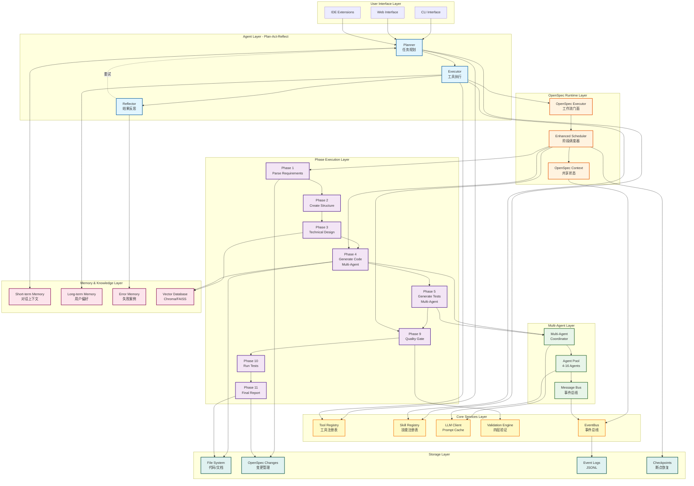

# System Architecture Diagram

## DevPalAgent 整体架构图



## 架构说明

### 分层设计

1. **User Interface Layer**: CLI、Web、IDE 多入口
2. **Agent Layer**: Plan-Act-Reflect 交互式链路
3. **OpenSpec Runtime Layer**: 确定性工作流执行
4. **Phase Execution Layer**: 11 阶段流水线
5. **Multi-Agent Layer**: 并行执行协调
6. **Core Services Layer**: 核心服务组件
7. **Memory & Knowledge Layer**: 记忆与知识管理
8. **Storage Layer**: 持久化存储

### 关键特性

- **双链路**: Agent 链路（灵活）+ OpenSpec 链路（确定性）
- **多智能体**: Phase 4/5 支持 4-16 个 Agent 并行
- **事件驱动**: EventBus 贯穿全流程
- **记忆系统**: 三层记忆 + 向量检索
- **可恢复**: Checkpoint 断点续传

### 数据流

```
User Request
    ↓
Planner (规划)
    ↓
Executor (执行) → OpenSpec Workflow
    ↓                     ↓
Reflector (反思)    Phase 1-11 (确定性流程)
    ↓                  ↓
                 Multi-Agent (并行)
              ↓
                 Quality Gate (验证)
                          ↓
                    Final Report (交付)
```
