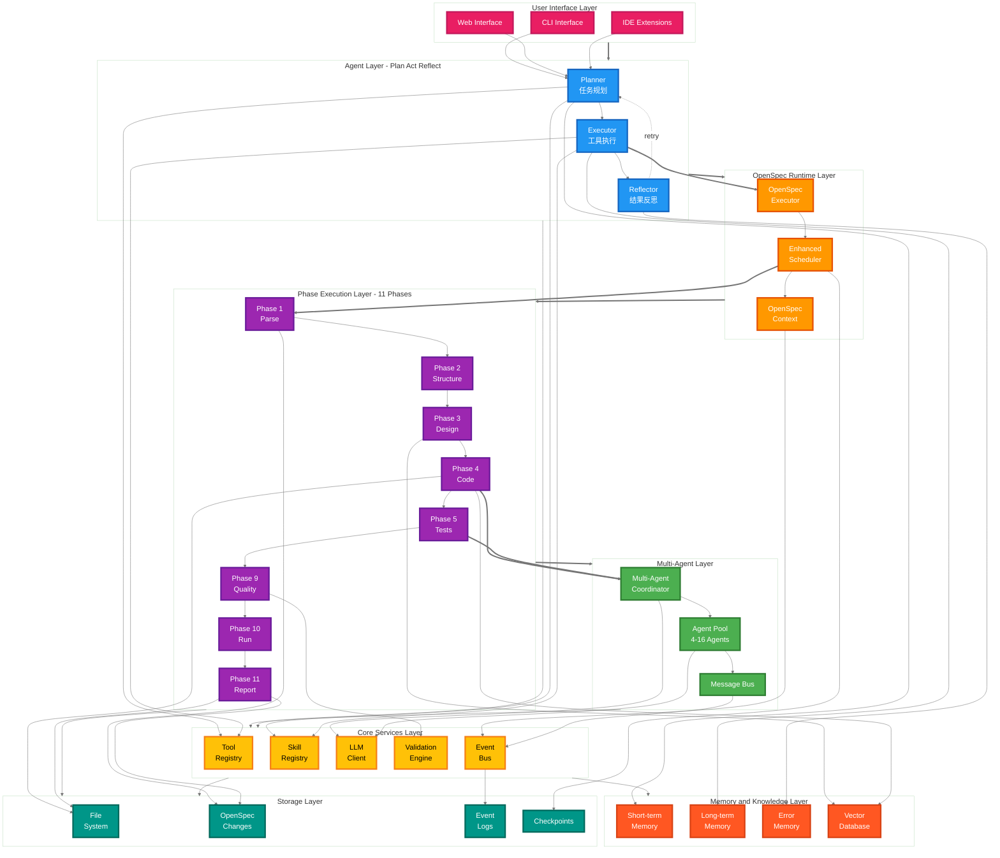

# System Architecture Diagram (v11 - No Overlapping)

## DevPalAgent 整体架构图 - 无重叠版



## 无重叠版特性 (v11)

### 🎯 彻底修复重叠问题

**1. 简化 subgraph 标题**:
- ❌ 去除中文描述（避免与节点重叠）
- ✅ 只保留简洁的英文标题
- 例如：`"User Interface Layer"` 代替 `"🖥️ User Interface Layer - 用户界面层"`

**2. 极简节点内容**:
- 节点只有 1-2 行文字
- 关键节点保留中文（如 Planner、Executor）
- Phase 节点简化为 "Phase X + 功能"

**3. 减小字体**:
- 字体大小：20px（更小，避免重叠）

**4. 对比示例**:

| 元素 | v10（重叠） | v11（无重叠）✅ |
|-----|------------|-------------|
| Subgraph 标题 | "🖥️ User Interface Layer - 用户界面层" | **"User Interface Layer"** |
| LLM Client 节点 | "LLM Client<br/>Prompt Cache<br/>缓存优化" | **"LLM<br/>Client"** |
| Phase 1 节点 | "Phase 1<br/>Parse Requirements<br/>需求解析" | **"Phase 1<br/>Parse"** |
| Multi-Agent Coordinator | "Multi-Agent Coordinator<br/>多智能体协调器<br/>..." | **"Multi-Agent<br/>Coordinator"** |

### ✨ 最终效果

- ✅ Subgraph 标题不再与节点重叠
- ✅ 节点内容极简（1-2 行）
- ✅ 字体更小（20px）
- ✅ 8 层架构结构清晰
- ✅ 颜色分类保留

### 🔧 生成命令

```bash
mmdc -i 01_system_architecture_v11.md \
     -o 01_system_architecture_v11.png \
     -w 3600 \
     -H 4800 \
     -s 3 \
     -b white
```
---

**版本**: v11.0 No Overlapping  
**关键修复**: 彻底解决所有文字重叠问题  
**方法**: 简化 subgraph 标题 + 极简节点内容 + 20px 小字体
