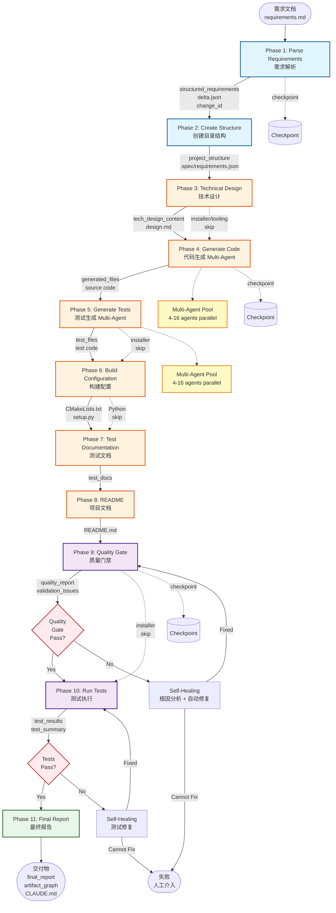

# OpenSpec 11-Phase Pipeline Diagram

## OpenSpec 11 阶段流程图



## 阶段详情

### Phase 1-3: 需求与设计
- **Phase 1**: 解析需求 → structured_requirements + delta.json + change_id
- **Phase 2**: 创建项目结构（语言感知）
- **Phase 3**: AI 生成技术设计文档

### Phase 4-5: 代码生成 (支持 Multi-Agent)
- **Phase 4**: 生成源代码（基础设施 + AI 业务代码）
  - 支持 4-16 个 Agent 并行生成
  - 依赖解析 + 拓扑排序
  - 3-4x 加速
- **Phase 5**: 生成测试代码
  - 同样支持 Multi-Agent 并行

### Phase 6-8: 构建与文档
- **Phase 6**: 生成构建配置（CMake/setup.py）
- **Phase 7**: 生成测试文档
- **Phase 8**: 生成 README

### Phase 9-10: 验证与测试
- **Phase 9**: Quality Gate 四层验证
  - L1: FORMAT
  - L2: SEMANTIC
  - L3: PARSER
  - L4: BUSINESS
  - 失败 → Self-Healing
- **Phase 10**: 执行测试
  - C++: GoogleTest
  - Python: pytest
  - 失败 → Self-Healing

### Phase 11: 最终报告
- 生成 final_report
- 生成 artifact_graph
- 生成 CLAUDE.md

## Phase Skip Rules

不同项目类型跳过不同阶段：

| 项目类型 | 跳过阶段 | 原因 |
|---------|---------|------|
| installer | Phase 3, 5-7, 9-10 | 安装脚本不需要复杂设计和测试 |
| tooling | Phase 3, 6 | 工具脚本简化流程 |
| python | Phase 6 | Python 不需要 CMake |

## Checkpoint & Resume

关键节点设置 Checkpoint：
- Phase 1: 需求解析完成
- Phase 4: 代码生成完成
- Phase 9: 质量验证完成

失败后可从最近的 Checkpoint 恢复。

## Self-Healing 流程

```
Phase 失败
    ↓
Root Cause Analysis (根因分析)
    ↓
Auto-Fix Strategy (自动修复策略)
    ↓
Apply Fix (应用修复)
    ↓
Re-run Phase (重新执行)
```

成功率：~80%
