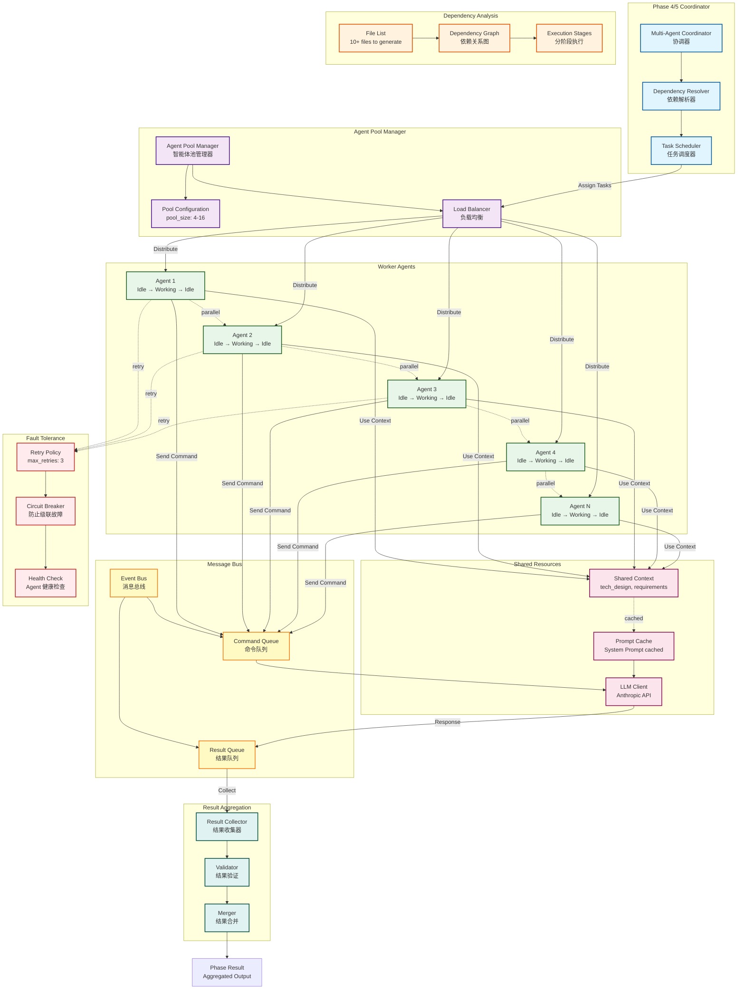

# Multi-Agent Architecture Diagram

## 多智能体并行执行架构图


## 执行流程

### 1. 依赖分析阶段
```
File List (10 files)
    ↓
Dependency Resolver 分析依赖
    ↓
Topological Sort 拓扑排序
    ↓
Execution Stages:
  Stage 1: [models/user.cpp, models/auth.cpp] (无依赖，并行)
  Stage 2: [services/user_service.cpp] (依赖 Stage 1)
  Stage 3: [api/user_api.cpp, api/auth_api.cpp] (依赖 Stage 2)
```

### 2. Agent 分配阶段
```
Task Scheduler
    ↓
Load Balancer (考虑 Agent 负载)
    ↓
分配到空闲 Agent:
  Agent 1 → models/user.cpp
  Agent 2 → models/auth.cpp
  Agent 3 → (等待 Stage 2)
  Agent 4 → (等待 Stage 2)
```

### 3. 并行执行阶段
```
All Agents 同时执行各自任务:

Agent 1: 
  ├─ 读取 Shared Context (cached)
  ├─ 调用 LLM (tech_design + task)
  └─ 生成 models/user.cpp

Agent 2:
  ├─ 读取 Shared Context (cached, 命中!)
  ├─ 调用 LLM (tech_design + task)
  └─ 生成 models/auth.cpp

成本节省: 
  - 无缓存: 2 × (2000 + 5000 + 500) = 15,000 tokens
  - 有缓存: 1 × cache_write + 1 × cache_read = ~2,500 tokens
  - 节省: 83%
```

### 4. 故障处理
```
Agent 3 生成失败
    ↓
Retry Policy: 尝试 1/3
    ↓
仍然失败
    ↓
Retry Policy: 尝试 2/3
    ↓
成功!
    ↓
Circuit Breaker: 监控失败率
    ↓
失败率 < 30%: 继续
```

### 5. 结果聚合
```
Result Collector 收集所有结果
    ↓
Validator 验证每个结果:
  ✓ models/user.cpp - valid
  ✓ models/auth.cpp - valid
  ✓ services/user_service.cpp - valid
  ✗ api/user_api.cpp - validation failed
  ↓
Retry api/user_api.cpp
    ↓
Merger 合并所有结果
    ↓
Phase Result (aggregated output)
```

## 性能对比

### 顺序执行 vs 并行执行

| 场景 | 顺序执行 | 并行执行 (4 agents) | 加速比 |
|-----|---------|----------|--------|
| 10 files | 10 × 30s = 300s | 3 stages × 30s = 90s | 3.3x |
| 20 files | 20 × 30s = 600s | 5 stages × 45s = 225s | 2.7x |
| 50 files | 50 × 30s = 1500s | 13 stages × 50s = 650s | 2.3x |

### Prompt Caching 收益

单个文件生成:
- System Prompt: 2000 tokens (cached)
- Tech Design: 5000 tokens (cached)
- Task: 500 tokens (uncached)

10 个文件并行生成:
- 第 1 个: (2000 + 5000) × cache_write + 500 = $0.0338
- 第 2-10 个: (2000 + 5000) × cache_read + 500 = $0.0096 × 9 = $0.0864
- Total: $0.1202
- 无缓存: $1.125
- **节省: 89%**

### 综合收益

并行加速 (3.3x) + 缓存节省 (89%) = **12x 综合效率提升**

## 配置示例

```yaml
# config/agent_pool.yaml
phase4_code_generation:
  pool_size: 4              # 4 个并行 Agent
  timeout_seconds: 300            # 单个任务超时
  retry_policy:
    max_retries: 3                # 最多重试 3 次
    backoff_multiplier: 2         # 指数退避
  circuit_breaker:
    failure_threshold: 0.3        # 30% 失败率触发断路器
    reset_timeout: 60             # 60 秒后重试
  health_check:
    interval_seconds: 10          # 每 10 秒健康检查
```
