# Quality Gate Validation Diagram

## Quality Gate 四层验证流程图

```mermaid
graph TD
    Start([Phase 9 开始<br/>generated_files]) --> PreCheck{文件<br/>存在?}
    
    PreCheck -->|No| Fail1([失败: 无文件生成])
    PreCheck -->|Yes| L1Start[L1: FORMAT Layer<br/>格式层验证]
    
    subgraph "L1: FORMAT Validation"
        L1Start --> L1Check1{语法<br/>正确?}
        L1Check1 -->|No| L1Fail[L1 FAIL<br/>Syntax Error]
        L1Check1 -->|Yes| L1Check2{文件<br/>结构?}
        L1Check2 -->|No| L1Fail
        L1Check2 -->|Yes| L1Check3{基础<br/>规范?}
        L1Check3 -->|No| L1Fail
        L1Check3 -->|Yes| L1Pass[L1 PASS<br/>0 issues]
    end
    
    L1Fail --> EarlyFail([终止: FORMAT 失败])
    L1Pass --> L2Start[L2: SEMANTIC Layer<br/>语义层验证]
    
    subgraph "L2: SEMANTIC Validation"
        L2Start --> L2Check1{依赖<br/>完整?}
        L2Check1 -->|No| L2Fail[L2 FAIL<br/>Missing Dependencies]
        L2Check1 -->|Yes| L2Check2{死代码<br/>检测?}
        L2Check2 -->|Yes| L2Fail
        L2Check2 -->|No| L2Check3{逻辑<br/>矛盾?}
        L2Check3 -->|Yes| L2Fail
        L2Check3 -->|No| L2Pass[L2 PASS<br/>0 issues]
  end
    
    L2Fail --> EarlyFail
    L2Pass --> L3Start[L3: PARSER Layer<br/>解析层验证]
    
    subgraph "L3: PARSER Validation"
        L3Start --> L3Check1{函数签名<br/>匹配?}
        L3Check1 -->|No| L3Fail[L3 FAIL<br/>Signature Mismatch]
        L3Check1 -->|Yes| L3Check2{调用关系<br/>完整?}
     L3Check2 -->|No| L3Fail
        L3Check2 -->|Yes| L3Check3{类型<br/>兼容?}
        L3Check3 -->|No| L3Fail
        L3Check3 -->|Yes| L3Pass[L3 PASS<br/>0 issues]
    end
    
    L3Fail --> EarlyFail
    L3Pass --> L4Start[L4: BUSINESS Layer<br/>业务层验证]
    
    subgraph "L4: BUSINESS Validation"
        L4Start --> L4Check1{命名<br/>规范?}
        L4Check1 -->|No| L4Fail[L4 FAIL<br/>Naming Convention]
        L4Check1 -->|Yes| L4Check2{敏感<br/>信息?}
        L4Check2 -->|Yes| L4Fail
        L4Check2 -->|No| L4Check3{需求<br/>覆盖?}
        L4Check3 -->|No| L4Fail
        L4Check3 -->|Yes| L4Check4{项目<br/>规则?}
        L4Check4 -->|No| L4Fail
        L4Check4 -->|Yes| L4Pass[L4 PASS<br/>0 issues]
    end
    
    L4Fail --> Decision{Severity<br/>CRITICAL?}
    Decision -->|Yes| SelfHeal[Self-Healing<br/>尝试自动修复]
    Decision -->|No| Warning[WARNING<br/>记录但继续]
    
    SelfHeal -->|Fixed| L1Start
    SelfHeal -->|Failed| ManualFix([人工修复])
    
    L4Pass --> Report[生成 Quality Report]
    Warning --> Report
    
    Report --> Critique[Phase 9.5<br/>Critique Phase<br/>LLM 深度审查]
    
    Critique --> CritiqueDecision{发现<br/>CRITICAL?}
    CritiqueDecision -->|Yes| SelfHeal
    CritiqueDecision -->|No| Success([Quality Gate PASSED<br/>进入 Phase 10])

    %% Styling
    classDef l1Class fill:#e1f5ff,stroke:#01579b,stroke-width:2px
    classDef l2Class fill:#fff3e0,stroke:#e65100,stroke-width:2px
    classDef l3Class fill:#f3e5f5,stroke:#4a148c,stroke-width:2px
    classDef l4Class fill:#e8f5e9,stroke:#1b5e20,stroke-width:2px
    classDef failClass fill:#ffebee,stroke:#c62828,stroke-width:2px
    classDef passClass fill:#e0f2f1,stroke:#004d40,stroke-width:2px
    classDef healClass fill:#fff9c4,stroke:#f57f17,stroke-width:2px
    
    class L1Start,L1Check1,L1Check2,L1Check3,L1Pass l1Class
    class L2Start,L2Check1,L2Check2,L2Check3,L2Pass l2Class
    class L3Start,L3Check1,L3Check2,L3Check3,L3Pass l3Class
    class L4Start,L4Check1,L4Check2,L4Check3,L4Check4,L4Pass l4Class
    class L1Fail,L2Fail,L3Fail,L4Fail,EarlyFail,Fail1,ManualFix failClass
    class Report,Success passClass
    class SelfHeal,Critique healClass
```



## 四层验证详解

### L1: FORMAT Layer (格式层)

**目标**: 验证基础语法和文件格式

**C++ 检查项**:
```cpp
// 1. 语法检查 (AST 解析)
clang -fsyntax-only file.cpp

// 2. 头文件保护
#ifndef USER_H
#define USER_H
...
#endif

// 3. 命名空间
namespace myproject {
...
}
```

**Python 检查项**:
```python
# 1. 语法检查
compile(code, filename, 'exec')

# 2. Import 格式
from typing import List, Optional

# 3. 缩进一致性
# 使用 4 空格缩进
```

**常见失败原因**:
- ❌ 语法错误：缺少分号、括号不匹配
- ❌ 头文件保护缺失
- ❌ 命名空间缺失

### L2: SEMANTIC Layer (语义层)

**目标**: 验证语义一致性和逻辑完整性

**检查项**:
```python
# 1. 依赖完整性
includes = extract_includes(file)
for inc in includes:
    if not exists(inc):
        issue("Missing dependency: " + inc)

# 2. 死代码检测
def unused_function():  # Never called
    pass

# 3. 逻辑矛盾
if True:
    ...
else:  # 永远不会执行
    ...
```

**常见失败原因**:
- ❌ 缺少 #include / import
- ❌ 未使用的函数、变量
- ❌ 不可达代码

### L3: PARSER Layer (解析层)

**目标**: 验证接口一致性和调用关系

**检查项**:
```cpp
// 1. 函数声明与定义匹配
// user.h
class User {
    void login(std::string username, std::string password);
};

// user.cpp
void User::login(std::string username, std::string password) {
    // 实现
}

// 2. 调用关系完整
void api_handler() {
    user.login("admin", "pass");  // login() 必须有定义
}
```

**常见失败原因**:
- ❌ 函数签名不匹配
- ❌ 调用未定义的函数
- ❌ 类型不兼容

### L4: BUSINESS Layer (业务层)

**目标**: 验证业务规则和需求覆盖

**检查项**:
```python
# 1. 命名规范
class UserService:  # ✓ PascalCase for class
    def get_user(self):  # ✓ snake_case for method
      pass

# 2. 敏感信息
password = "hardcoded_password"  # ❌ 不应硬编码
api_key = os.getenv("API_KEY")   # ✓ 从环境变量读取

# 3. 需求覆盖
requirements = {
    "REQ-001": "User login",
    "REQ-002": "Password validation",
}

implemented = scan_code_for_requirements()
for req_id in requirements:
    if req_id not in implemented:
        issue(f"Requirement {req_id} not implemented")
```

**常见失败原因**:
- ❌ 命名不符合规范
- ❌ 硬编码敏感信息
- ❌ 需求未完整实现
- ❌ 违反项目特定规则

## 验证器实现

### 语言感知验证器

```python
class ValidationEngine:
    def validate(self, files, language, requirements):
        if language == "cpp":
            validator = CppValidator()
        elif language == "python":
            validator = PythonValidator()
        else:
            validator = GenericValidator()
        
     # L1-L4 顺序验证
        for layer in [L1, L2, L3, L4]:
            issues = validator.validate_layer(layer, files, requirements)
            if issues:
                return ValidationResult(
                success=False,
                 layer=layer,
                    issues=issues
                )
        
        return ValidationResult(success=True, issues=[])
```

### 验证规则配置

```yaml
# .devpal/quality_rules.yaml
format:
  cpp:
    - check_syntax: true
    - check_header_guards: true
    - check_namespace: true
  python:
    - check_syntax: true
    - check_imports: true

semantic:
  - check_dependencies: true
  - detect_dead_code: true
  - detect_contradictions: true

parser:
  - match_function_signatures: true
  - verify_call_graph: true
  - check_type_compatibility: true

business:
  naming_convention:
    class: PascalCase
    function: snake_case
    variable: snake_case
  security:
    - no_hardcoded_secrets: true
    - no_sql_injection: true
  requirement_coverage:
    - enforce: true
```

## Quality Gate Report 示例

```markdown
# Quality Gate Report

**Project**: cpp_simple_login
**Date**: 2026-06-04 16:00:00
**Files**: 4

## Summary
✅ **PASSED** - All layers validated successfully

| Layer | Status | Issues |
|-------|--------|--------|
| L1: FORMAT | ✅ PASS | 0 |
| L2: SEMANTIC | ✅ PASS | 0 |
| L3: PARSER | ✅ PASS | 0 |
| L4: BUSINESS | ✅ PASS | 0 |

## Details

### L1: FORMAT
- ✅ All files have valid syntax
- ✅ All .h files have header guards
- ✅ All files use namespace

### L2: SEMANTIC
- ✅ All dependencies resolved
- ✅ No dead code detected
- ✅ No logic contradictions

### L3: PARSER
- ✅ Function signatures match
- ✅ Call graph complete
- ✅ Type compatibility verified

### L4: BUSINESS
- ✅ Naming convention followed
- ✅ No sensitive data exposed
- ✅ All requirements implemented (4/4)
  - REQ-001 ✅
  - REQ-002 ✅
  - REQ-003 ✅
  - REQ-004 ✅

## Recommendation
✅ Code quality excellent. Proceed to testing.
```

## 失败案例示例

```markdown
# Quality Gate Report

**Project**: example_project
**Date**: 2026-06-04
**Files**: 5

## Summary
❌ **FAILED** - L3 PARSER validation failed

| Layer | Status | Issues |
|-------|--------|--------|
| L1: FORMAT | ✅ PASS | 0 |
| L2: SEMANTIC | ✅ PASS | 0 |
| L3: PARSER | ❌ FAIL | 2 |
| L4: BUSINESS | ⏭️ SKIPPED | - |

## Issues Found

### L3: PARSER (2 issues)

**Issue 1**: Function signature mismatch
- **File**: `src/user_service.cpp:42`
- **Severity**: CRITICAL
- **Description**: Function definition doesn't match declaration
- **Expected**: `void login(std::string username, std::string password)`
- **Found**: `void login(std::string user, std::string pwd)`
- **Fix**: Update parameter names to match header

**Issue 2**: Undefined function call
- **File**: `src/api.cpp:25`
- **Severity**: HIGH
- **Description**: Function `validate_token()` is called but not defined
- **Fix**: Implement `validate_token()` or remove the call

## Actions Required
1. Fix L3 issues
2. Re-run Quality Gate
3. If passed, continue to L4 validation
```
