# Quality Gate Validation Diagram (v11 Optimized)

## Quality Gate 四层验证流程图 - 优化版

```mermaid
%%{init: {'theme':'default', 'themeVariables': { 'fontSize':'20px', 'fontFamily':'Arial, Helvetica, sans-serif', 'background':'#FFFFFF', 'clusterBkg':'#FFFFFF', 'clusterBorder':'#BDBDBD'}}}%%
graph LR
    Start([Phase 9 开始]) --> PreCheck{文件存在?}
    
    PreCheck -->|No| Fail1([失败])
    PreCheck -->|Yes| L1
    
    subgraph L1Layer["L1: FORMAT Validation"]
        L1[Format Layer] --> L1C1{语法?}
      L1C1 -->|No| L1F([L1 FAIL])
        L1C1 -->|Yes| L1C2{结构?}
     L1C2 -->|No| L1F
        L1C2 -->|Yes| L1P[L1 PASS]
    end
    
    L1F --> Stop([终止])
    L1P --> L2
    
    subgraph L2Layer["L2: SEMANTIC Validation"]
        L2[Semantic Layer] --> L2C1{依赖?}
        L2C1 -->|No| L2F([L2 FAIL])
        L2C1 -->|Yes| L2C2{死代码?}
      L2C2 -->|Yes| L2F
        L2C2 -->|No| L2P[L2 PASS]
    end
    
    L2F --> Stop
    L2P --> L3
    
    subgraph L3Layer["L3: PARSER Validation"]
        L3[Parser Layer] --> L3C1{签名?}
        L3C1 -->|No| L3F([L3 FAIL])
        L3C1 -->|Yes| L3C2{调用?}
        L3C2 -->|No| L3F
        L3C2 -->|Yes| L3P[L3 PASS]
    end
    
    L3F --> Stop
    L3P --> L4
    
    subgraph L4Layer["L4: BUSINESS Validation"]
        L4[Business Layer] --> L4C1{命名?}
     L4C1 -->|No| L4F([L4 FAIL])
        L4C1 -->|Yes| L4C2{敏感信息?}
        L4C2 -->|Yes| L4F
        L4C2 -->|No| L4C3{需求?}
        L4C3 -->|No| L4F
        L4C3 -->|Yes| L4P[L4 PASS]
    end
    
    L4F --> Severity{CRITICAL?}
    Severity -->|Yes| Heal[Self-Healing]
    Severity -->|No| Warn[WARNING]
    
    Heal -->|Fixed| L1
    Heal -->|Failed| Manual([人工修复])
    
    L4P --> Report[Quality Report]
    Warn --> Report
    
    Report --> Critique[Critique Phase]
    Critique --> Final{CRITICAL?}
    Final -->|Yes| Heal
    Final -->|No| Success([PASSED])

    classDef l1Class fill:#2196F3,stroke:#1565C0,stroke-width:3px,color:#fff
    classDef l2Class fill:#FF9800,stroke:#E65100,stroke-width:3px,color:#fff
    classDef l3Class fill:#9C27B0,stroke:#6A1B9A,stroke-width:3px,color:#fff
    classDef l4Class fill:#4CAF50,stroke:#2E7D32,stroke-width:3px,color:#fff
    classDef failClass fill:#F44336,stroke:#C62828,stroke-width:3px,color:#fff
    classDef passClass fill:#009688,stroke:#00695C,stroke-width:3px,color:#fff
    classDef healClass fill:#FFC107,stroke:#F57F17,stroke-width:3px,color:#000
    
    class L1,L1C1,L1C2,L1P l1Class
    class L2,L2C1,L2C2,L2P l2Class
    class L3,L3C1,L3C2,L3P l3Class
    class L4,L4C1,L4C2,L4C3,L4P l4Class
    class L1F,L2F,L3F,L4F,Stop,Fail1,Manual failClass
    class Report,Success passClass
    class Heal,Critique,Warn healClass
```



## 优化说明 (v11)

### 布局改进

**原版问题**:
- ❌ 纵向布局（TB），过于狭长
- ❌ 每层验证详细展开，占用大量纵向空间
- ❌ 4 层堆叠，总高度过高

**v11 优化**:
- ✅ 横向布局（LR），更紧凑
- ✅ 简化节点内容，去除冗余文字
- ✅ 4 层并排，充分利用横向空间
- ✅ 保留核心流程，简化检查细节

### 节点简化对比

| 层级 | 原版 | v11 优化 |
|-----|------|---------|
| L1 入口 | "L1: FORMAT Layer<br/>格式层验证" | "Format Layer" |
| L1 检查1 | "语法<br/>正确?" | "语法?" |
| L1 失败 | "L1 FAIL<br/>Syntax Error" | "L1 FAIL" |
| L1 通过 | "L1 PASS<br/>0 issues" | "L1 PASS" |

### 尺寸优化

| 特性 | 原版 | v11 |
|-----|-----|
| 方向 | TB (纵向) | **LR (横向)** |
| 预期宽高比 | 1:3 (窄高) | **3:1 (宽扁)** |
| 适合场景 | A4 纵向 | **16:9 投影** |

### 保留核心信息

- ✅ 4 层验证流程
- ✅ 早失败机制（L1/L2/L3 失败即终止）
- ✅ Self-Healing 机制
- ✅ Critique Phase
- ✅ CRITICAL 判断

### 颜色方案

使用 v11 Material Design 深色系：
- L1 FORMAT: 深蓝 (#2196F3)
- L2 SEMANTIC: 深橙 (#FF9800)
- L3 PARSER: 深紫 (#9C27B0)
- L4 BUSINESS: 深绿 (#4CAF50)
- FAIL: 红色 (#F44336)
- PASS: 青绿 (#009688)
- Self-Healing: 金黄 (#FFC107)

## 生成命令

```bash
node ~/.claude/skills/mermaid-to-png/mermaid-to-png-v11.js \
    04_quality_gate_v11.md \
    . \
    --width=4800 \
    --height=2400 \
    --scale=3 \
    --background=white
```

---

**版本**: v11 Optimized  
**布局**: LR (横向)  
**优化**: 紧凑布局 + 简化节点 + 横向展开
