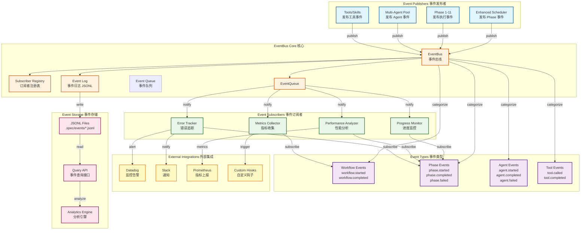

# EventBus Architecture Diagram

## EventBus 事件驱动架构图



## 事件流转详解

### 1. 事件发布流程

```python
# Publisher 发布事件
class EnhancedScheduler:
    def run_phase(self, phase_num, phase):
        # 1. 发布 phase.started 事件
        self.event_bus.publish(PhaseStartedEvent(
            workflow_id=self.workflow_id,
            phase_num=phase_num,
          phase_name=phase.phase_name,
         timestamp=datetime.now()
        ))
        
        # 2. 执行 Phase
        result = phase.execute(self.context)
        
        # 3. 发布 phase.completed 事件
        self.event_bus.publish(PhaseCompletedEvent(
            workflow_id=self.workflow_id,
            phase_num=phase_num,
            success=result.success,
            duration=result.duration,
            timestamp=datetime.now()
      ))
```

### 2. 事件订阅流程

```python
# Subscriber 订阅事件
class ProgressMonitor:
    def __init__(self, event_bus):
        # 订阅所有 Phase 事件
      event_bus.subscribe("phase.started", self.on_phase_started)
        event_bus.subscribe("phase.completed", self.on_phase_completed)
        event_bus.subscribe("phase.failed", self.on_phase_failed)
    
    def on_phase_started(self, event):
    """处理 Phase 开始事件"""
    print(f"[Progress] Phase {event.phase_num} started: {event.phase_name}")
        self.current_phase = event.phase_num
    
    def on_phase_completed(self, event):
        """处理 Phase 完成事件"""
        progress = (event.phase_num / 11) * 100
        print(f"[Progress] {progress:.1f}% - Phase {event.phase_num} completed")
```

### 3. 事件持久化

```python
# EventBus 持久化事件
class EventBus:
    def publish(self, event: Event):
        # 1. 记录到内存
        self._event_log.append(event)
        
     # 2. 持久化到 JSONL
        event_file = f".spec/events/{self.workflow_id}.jsonl"
        with open(event_file, 'a') as f:
            f.write(json.dumps(event.to_dict()) + '\n')
        
        # 3. 通知订阅者
        for subscriber in self._subscribers[event.event_type]:
            try:
              subscriber(event)
        except Exception as e:
             print(f"[EventBus] Subscriber error: {e}")
```

## 事件类型定义

### Workflow Events

```python
# workflow.started
{
  "event_type": "workflow.started",
    "timestamp": "2026-06-04T16:00:00",
  "workflow_id": "abc123",
    "payload": {
     "requirements_file": "requirements/login.md",
        "language": "cpp",
        "project_type": "library"
    }
}

# workflow.completed
{
    "event_type": "workflow.completed",
    "timestamp": "2026-06-04T16:05:30",
    "workflow_id": "abc123",
    "payload": {
        "success": true,
        "total_duration": 330.5,
        "phases_completed": 11,
     "phases_failed": 0
    }
}
```

### Phase Events

```python
# phase.started
{
    "event_type": "phase.started",
    "timestamp": "2026-06-04T16:01:00",
    "workflow_id": "abc123",
    "payload": {
        "phase_num": 4,
        "phase_name": "Generate Code"
    }
}

# phase.completed
{
    "event_type": "phase.completed",
    "timestamp": "2026-06-04T16:02:30",
    "workflow_id": "abc123",
    "payload": {
        "phase_num": 4,
        "success": true,
      "duration": 90.5,
        "files_generated": 10
    }
}

# phase.failed
{
    "event_type": "phase.failed",
    "timestamp": "2026-06-04T16:03:00",
    "workflow_id": "abc123",
    "payload": {
        "phase_num": 9,
        "error_message": "Quality Gate failed",
     "error_category": "VALIDATION",
        "issues_count": 3
    }
}
```

### Agent Events

```python
# agent.started
{
  "event_type": "agent.started",
    "timestamp": "2026-06-04T16:01:05",
    "workflow_id": "abc123",
    "payload": {
        "agent_id": "agent_1",
      "task": "generate src/user.cpp"
    }
}

# agent.completed
{
    "event_type": "agent.completed",
    "timestamp": "2026-06-04T16:01:35",
    "workflow_id": "abc123",
    "payload": {
        "agent_id": "agent_1",
        "success": true,
        "duration": 30.2,
        "output_file": "src/user.cpp"
    }
}
```

## 监控器实现

### Progress Monitor

```python
class ProgressMonitor:
    ""实时进度监控"""
    
    def __init__(self):
        self.total_phases = 11
      self.completed_phases = 0
    self.start_time = None
    
    def on_workflow_started(self, event):
        self.start_time = event.timestamp
      print(f"\n{'='*70}")
        print(f" Workflow Started: {event.workflow_id}")
        print(f" Language: {event.payload['language']}")
      print(f"{'='*70}\n")
    
    def on_phase_started(self, event):
        phase_num = event.payload['phase_num']
        phase_name = event.payload['phase_name']
        progress = (phase_num / self.total_phases) * 100
      
        print(f"[{progress:5.1f}%] Phase {phase_num}: {phase_name}")
    
    def on_phase_completed(self, event):
      self.completed_phases += 1
      duration = event.payload['duration']
        
        # 估算剩余时间
        elapsed = (event.timestamp - self.start_time).total_seconds()
        avg_time = elapsed / self.completed_phases
        remaining = avg_time * (self.total_phases - self.completed_phases)
        
        print(f"  ✓ Completed in {duration:.1f}s")
        print(f"  Estimated remaining: {remaining:.1f}s\n")
```

### Performance Analyzer

```python
class PerformanceAnalyzer:
    """性能分析器"""
    
    def __init__(self):
        self.phase_durations = defaultdict(list)
        self.workflow_start = None
    
    def on_workflow_started(self, event):
        self.workflow_start = event.timestamp
    
    def on_phase_completed(self, event):
        phase_num = event.payload['phase_num']
        duration = event.payload['duration']
     self.phase_durations[phase_num].append(duration)
    
    def on_workflow_completed(self, event):
        """生成性能报告"""
     total_duration = (event.timestamp - self.workflow_start).total_seconds()
        
        print("\n" + "="*70)
        print(" Performance Analysis Report")
        print("="*70)
        print(f"\nTotal Duration: {total_duration:.2f}s\n")
        print("Phase Performance:")
        print("-"*70)
        
        for phase_num in sorted(self.phase_durations.keys()):
            durations = self.phase_durations[phase_num]
            avg_duration = statistics.mean(durations)
            percentage = (avg_duration / total_duration) * 100
          
            bar = "#" * int(percentage / 3)
          print(f"  Phase {phase_num:2d}: {avg_duration:6.2f}s [{bar:<30}] {percentage:5.1f}%")
      
        # 识别瓶颈
        slowest_phase = max(self.phase_durations.items(), 
                          key=lambda x: statistics.mean(x[1]))
        slowest_num, slowest_times = slowest_phase
        slowest_avg = statistics.mean(slowest_times)
        
        print(f"\n  Slowest Phase: Phase {slowest_num} ({slowest_avg:.2f}s)\n")
        
        # 性能建议
        if slowest_avg > 60:
            print("Performance Recommendations:")
          print(f"  - Phase {slowest_num} takes {slowest_avg:.1f}s, consider optimization")
        
        print("="*70)
```

### Error Tracker

```python
class ErrorTracker:
    """错误追踪器"""
    
    def __init__(self):
     self.errors = []
        self.error_categories = Counter()
    
    def on_phase_failed(self, event):
        """处理 Phase 失败事件"""
        error_info = {
            "timestamp": event.timestamp,
            "phase_num": event.payload['phase_num'],
            "error_message": event.payload['error_message'],
            "error_category": event.payload['error_category']
        }
        
        self.errors.append(error_info)
        self.error_categories[error_info['error_category']] += 1
        
        # 实时告警
        print(f"\n⚠️  Phase {error_info['phase_num']} FAILED")
        print(f"   Error: {error_info['error_message']}")
        print(f"   Category: {error_info['error_category']}\n")
        
        # 如果是 CRITICAL 错误，发送外部告警
        if error_info['error_category'] == 'CRITICAL':
            self._send_alert_to_slack(error_info)
            self._send_alert_to_datadog(error_info)
    
    def _send_alert_to_slack(self, error_info):
        """发送到 Slack"""
        slack_client.send_message(
            channel="#devpal-alerts",
            text=f"🚨 Critical Error in Phase {error_info['phase_num']}: {error_info['error_message']}"
        )
    
    def _send_alert_to_datadog(self, error_info):
        """发送到 Datadog"""
        datadog.api.Event.create(
        title=f"DevPalAgent Phase Failed",
            text=f"Phase {error_info['phase_num']} failed: {error_info['error_message']}",
            alert_type="error",
          tags=[f"phase:{error_info['phase_num']}", f"category:{error_info['error_category']}"]
      )
```

## 事件查询 API
### 查询接口

```python
# 查询最近 workflow 的事件
events = event_query.query_by_workflow(workflow_id="abc123")

# 查询特定类型的事件
phase_events = event_query.query_by_type("phase.completed")

# 查询时间范围内的事件
recent_events = event_query.query_by_time_range(
    start=datetime(2026, 6, 4, 16, 0),
    end=datetime(2026, 6, 4, 17, 0)
)

# 生成 workflow 摘要
summary = event_query.get_workflow_summary(workflow_id="abc123")
# {
#     "total_duration": 330.5,
#     "phases_completed": 11,
#     "phases_failed": 0,
#     "success": true
# }
```

### CLI 工具

```bash
# 查询最近一次 workflow
python -m devpal.eventbus query --latest

# 查询特定 workflow
python -m devpal.eventbus query --workflow-id abc123

# 过滤事件类型
python -m devpal.eventbus query --type phase.failed

# 生成性能报告
python -m devpal.eventbus analyze --workflow-id abc123

# 导出事件日志
python -m devpal.eventbus export --workflow-id abc123 --output events.json
```

## 扩展性设计

### 自定义监控器

```python
# 用户自定义监控器
class CustomDashboardMonitor:
    """自定义仪表板监控器"""
    
    def __init__(self, dashboard_url):
    self.dashboard_url = dashboard_url
    
    def on_workflow_started(self, event):
        """Workflow 开始时更新仪表板"""
        requests.post(f"{self.dashboard_url}/workflow/start", json=event.to_dict())
    
    def on_phase_completed(self, event):
        """Phase 完成时更新进度"""
        requests.post(f"{self.dashboard_url}/phase/complete", json=event.to_dict())

# 注册到 EventBus
event_bus = EventBus()
custom_monitor = CustomDashboardMonitor("https://dashboard.example.com")
event_bus.subscribe("workflow.started", custom_monitor.on_workflow_started)
event_bus.subscribe("phase.completed", custom_monitor.on_phase_completed)
```

### 插件式集成

```python
# 插件接口
class EventBusPlugin(ABC):
    @abstractmethod
    def on_event(self, event: Event) -> None:
        """处理事件"""
        pass

# Prometheus 插件
class PrometheusPlugin(EventBusPlugin):
    def on_event(self, event: Event):
    if event.event_type == "phase.completed":
            prometheus_client.histogram(
                "devpal_phase_duration_seconds",
                event.payload['duration'],
         labels={"phase": str(event.payload['phase_num'])}
            )

# 加载插件
event_bus.load_plugin(PrometheusPlugin())
```
