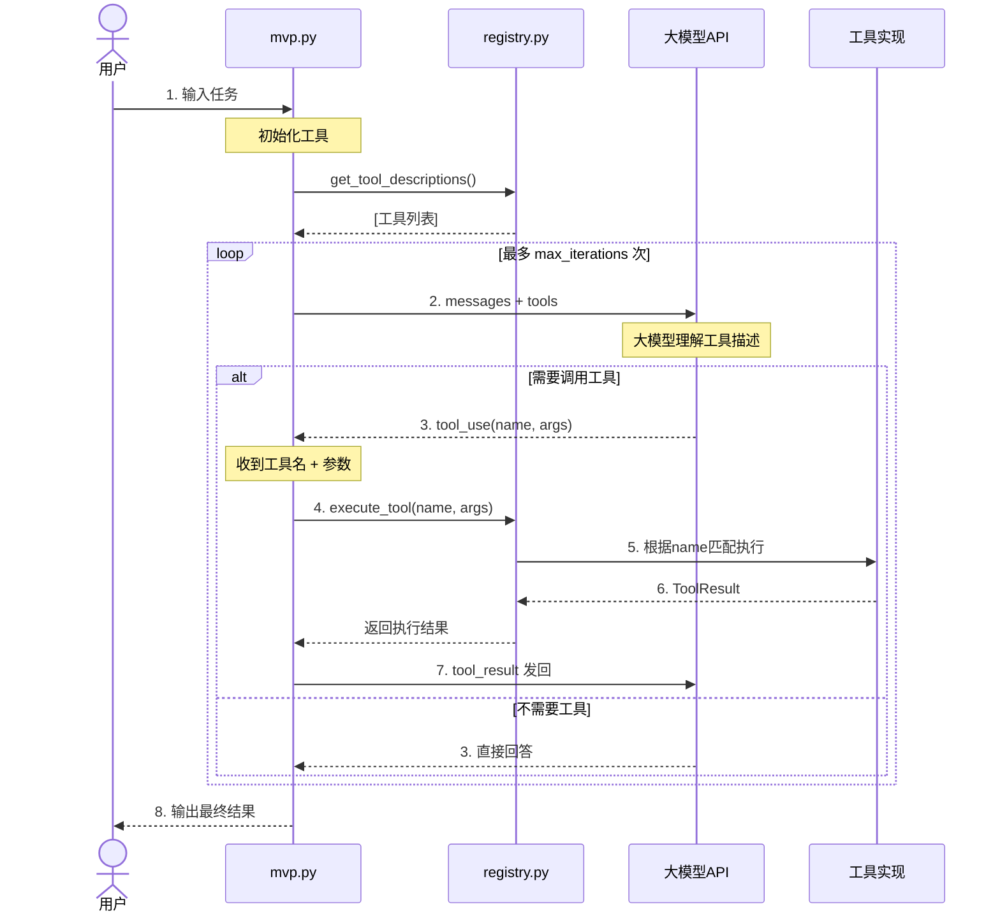

# DevPal Agent Tool Calling 时序图（优化版）



---

## 关键交互点：

| 步骤 | 说明 | 核心契约 |
|------|------|---------|
| 2 | **工具描述发送** | name + description + schema |
| 3 | **大模型返回** | 严格使用相同的 `name` 字符串 |
| 4 | **本地匹配** | `registry.get(name)` 精确查找 |

---

## 核心设计原则：

**工具名 `name` 是贯穿全流程的唯一契约 ID**

```
定义时: FileWriterTool.name = "file_writer"
    ↓
发送时: "name": "file_writer"
    ↓
返回时: block.name = "file_writer"
    ↓
执行时: registry.get("file_writer")
```
