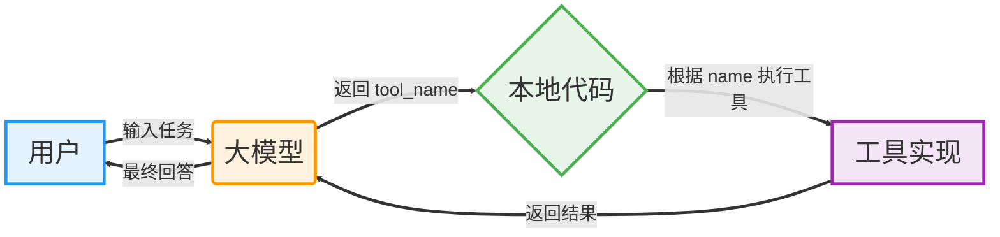

# DevPal Agent 极简流程图



---

```
              工具描述发给大模型
                     ↓
用户输入 → 大模型决策 → 返回 name → 本地匹配执行 → 结果回传
                     ↑                          │
                     └──────────────────────────┘
```

**核心：工具名 name 是唯一契约，贯穿全程！**
