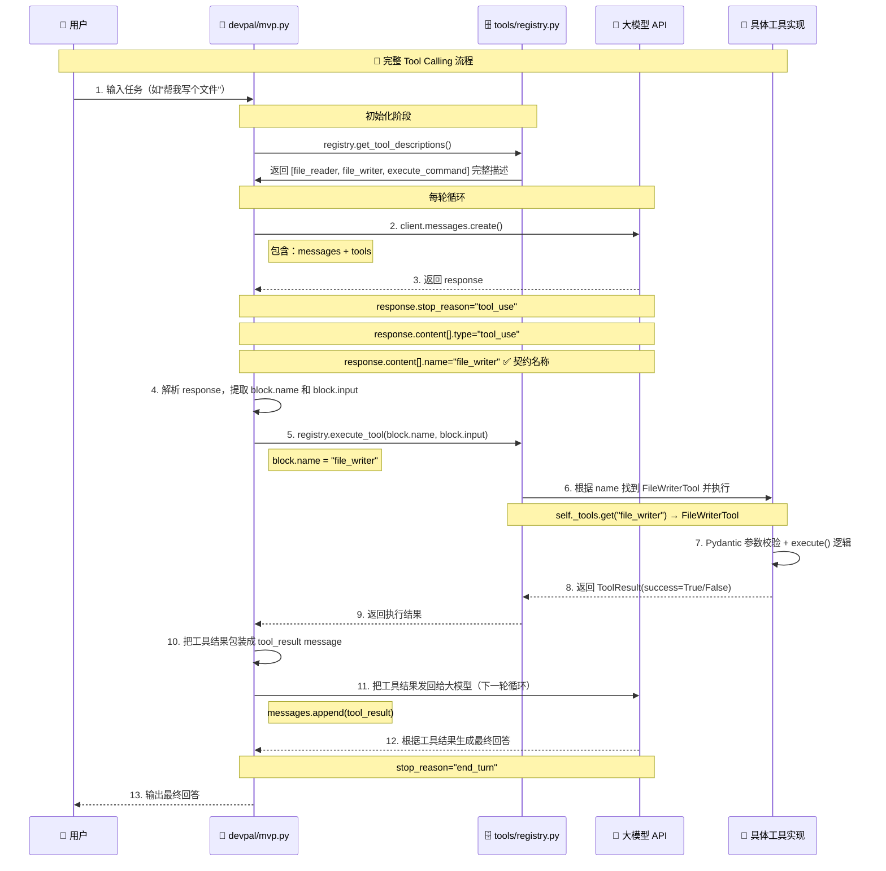

# DevPal Agent Tool Calling 完整时序图



---

## 🔍 关键节点详解

| 步骤 | 说明 | 核心代码 |
|------|------|---------|
| **契约绑定** | 工具名 `file_writer` 是双方约定的唯一 ID | `FileWriterTool.name = "file_writer"` |
| **工具描述发送** | 把 name/description/schema 发给大模型 | `client.messages.create(tools=...)` |
| **大模型决策** | 阅读工具描述，选择最适合的工具，生成合法参数 | 大模型内部逻辑 |
| **精确匹配** | 根据返回的 `block.name` 找到对应实现 | `self._tools.get(tool_name)` |
| **结果回传** | 把执行结果发回大模型，让它看到工具做了什么 | `messages.append(tool_result)` |

---

## 📊 循环流程示意图

```
用户输入
   ↓
┌─────────────────────────────────────────┐
│  🔄 主循环 (最多 max_iterations 次)     │
│                                         │
│  ┌──────────┐     ┌────────────────┐  │
│  │  问大模型 │────▶│ 需要调用工具吗?│  │
│  └──────────┘     └────────┬───────┘  │
│      ↑                     │ 是        │
│      │                     ▼           │
│      │               ┌──────────┐      │
│      │               │ 执行工具 │      │
│      │               └────┬─────┘      │
│      │                    │            │
│      │                    ▼            │
│      │            ┌─────────────┐     │
│      │            │ 结果发回大模型│────┘
│      │            └─────────────┘
│      │                    否
│      └─────────────────────┘
   ↓
输出最终回答
```
