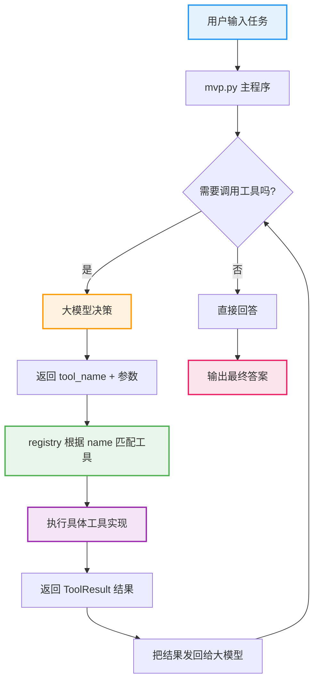

# DevPal Agent Tool Calling 简洁流程图


```mermaid
flowchart TD
    A[用户输入任务] --> B[mvp.py 主程序]
    B --> C{需要调用工具吗?}
    
    C -->|是| D[大模型决策]
    C -->|否| E[直接回答]
    
    D --> F[返回 tool_name + 参数]
    F --> G[registry 根据 name 匹配工具]
    G --> H[执行具体工具实现]
    H --> I[返回 ToolResult 结果]
    I --> J[把结果发回给大模型]
    J --> C
    
    E --> K[输出最终答案]
    
    style A fill:#e3f2fd,stroke:#2196f3,stroke-width:2px
    style D fill:#fff3e0,stroke:#ff9800,stroke-width:2px
    style G fill:#e8f5e9,stroke:#4caf50,stroke-width:2px
    style H fill:#f3e5f5,stroke:#9c27b0,stroke-width:2px
    style K fill:#fce4ec,stroke:#e91e63,stroke-width:2px
```

---

## 核心原理（一句话）：

**本地把工具描述发给大模型 → 大模型看懂后返回工具名 → 本地根据工具名找到对应代码执行**

```
工具定义(name, desc, schema) → 大模型 → tool_use(name, args) → 执行代码
```
