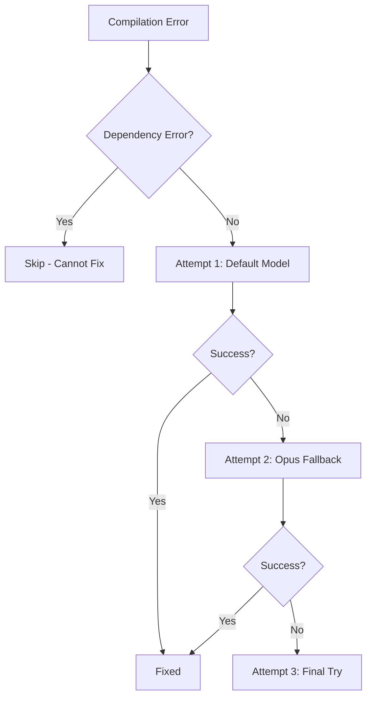

# DevPalAgent 后续发展规划 - 面试展示优化

## Context

DevPalAgent 是一个 Spec-first Agentic SDLC Runtime,已完成 M1 (语言感知闭环稳定版)。当前状态:
- ✅ OpenSpec 11-Phase Pipeline 完整运行
- ✅ Phase 10 自愈机制 (3次尝试 + Opus fallback)
- ✅ 多语言支持 (C++/Python/Shell/Installer)
- ✅ 质量门禁 + 测试执行
- ✅ 17/17 测试通过

**用户目标**: 将项目用于 Agent 工程师面试展示,需要增强现有功能以突出:
1. 架构设计能力
2. 多Agent协作
3. 自愈机制
4. 可追踪性

**用户选择的优先级**:
- 首要目标: 增强现有功能 (而非M2新功能)
- M2相关: Markdown Delta格式、Change-ID追踪、Given/When/Then场景
- 应用场景: 面试展示项目

## 当前Gap分析

### 1. 面试展示维度的不足

**架构可视化**:
- ❌ 缺少架构图生成
- ❌ 缺少Agent协作流程图
- ❌ 缺少Phase依赖关系可视化

**可追踪性展示**:
- ⚠️ ArtifactGraph 存在但不够直观
- ❌ 缺少需求→代码→测试的可视化追踪
- ❌ 缺少变更历史时间线

**自愈机制展示**:
- ✅ 自愈逻辑已完善
- ❌ 缺少自愈过程的详细记录
- ❌ 缺少自愈决策的可视化

**文档完整性**:
- ⚠️ FINAL_SUMMARY.md 存在但不够结构化
- ❌ 缺少面试问答文档
- ❌ 缺少架构决策记录 (ADR)
### 2. 技术债务

**代码质量**:
- ⚠️ ValidationEngine (719 LOC) 未完全集成到 Phase 9
- ⚠️ EventBus (696 LOC) 未在主流程使用
- ⚠️ DeltaSpec (614 LOC) 仅支持文件级diff

**测试覆盖**:
- ✅ 22个测试通过
- ❌ 缺少自愈机制的单元测试
- ❌ 缺少多语言集成测试

## 推荐方案: 面试展示增强计划

### Phase 1: 文档与可视化增强 (优先级: P0, 工期: 2天)

**目标**: 让面试官快速理解项目价值和技术深度

#### 1.1 创建面试展示文档包
```
doc3.0/interview/
├── INTERVIEW_GUIDE.md          # 面试官快速导览
├── ARCHITECTURE_DECISIONS.md   # 关键架构决策记录
├── SELF_HEALING_SHOWCASE.md    # 自愈机制详解
├── MULTI_AGENT_COLLABORATION.md # Agent协作模式
└── DEMO_SCENARIOS.md           # 演示场景脚本
```

**关键内容**:
- **INTERVIEW_GUIDE.md**: 5分钟快速演示脚本 + 常见问题解答
- **ARCHITECTURE_DECISIONS.md**: 为什么选择Plan-Act-Reflect? 为什么11个Phase? 为什么3次自愈?
- **SELF_HEALING_SHOWCASE.md**: 展示自愈前后对比、决策树、成功率统计
- **MULTI_AGENT_COLLABORATION.md**: Planner/Executor/Reflector协作流程图

#### 1.2 增强 Final Report 可视化
**文件**: `devpal/core/openspec_phases/phase11_final_report.py`

**新增内容**:
```markdown
## 🎯 Project Summary
- Language: C++
- Requirements: 4 items
- Generated Files: 30
- Test Coverage: 17/17 (100%)
- Self-Healing: 0 attempts (code quality excellent)

## 📊 Phase Execution Timeline
```
Phase 1 ████████░░ 0.07s
Phase 2 █░░░░░░░░░ 0.00s
Phase 3 ██████████ 57.40s
...
```

## 🔗 Requirement Traceability
REQ-001 → [user.h, user.cpp] → [test_user.cpp] ✅
REQ-002 → [login_service.h, login_service.cpp] → [test_login_service.cpp] ✅
...

## 🏥 Self-Healing Report
- Compilation Errors: 0
- Test Failures: 0
- Auto-Fixed Issues: 0
- Model Switches: 0
```

**实现要点**:
- 添加 `_generate_timeline_visualization()` 方法
- 添加 `_generate_traceability_matrix()` 方法
- 添加 `_generate_self_healing_summary()` 方法

#### 1.3 生成架构图
**新文件**: `devpal/tools/architecture_visualizer.py`

**功能**:
- 生成 Mermaid 格式的架构图
- Agent协作流程图
- Phase依赖关系图
- 自愈决策树

**集成点**: Phase 11 自动生成并保存到 `docs/architecture/`

### Phase 2: 自愈机制增强 (优先级: P1, 工期: 1天)

**目标**: 让自愈过程可追踪、可复现

#### 2.1 自愈日志增强
**文件**: `devpal/core/openspec_phases/test_self_healer.py`

**新增**:
```python
class HealingAttempt:
    attempt_number: int
    model_used: str
    error_type: str
    error_message: str
    fix_strategy: str
    code_before: str
    code_after: str
    success: bool
    timestamp: datetime

class SelfHealingReport:
    total_attempts: int
    successful_heals: int
    failed_heals: int
    model_switches: int
    attempts: List[HealingAttempt]
    
    def to_markdown(self) -> str:
        """生成详细的自愈报告"""
```

**输出**: `docs/self_healing_report.md`

#### 2.2 自愈决策可视化
**新增方法**: `TestSelfHealer._visualize_healing_decision()`

**输出 Mermaid 决策树**:


### Phase 3: Markdown Delta + Change-ID (优先级: P1, 工期: 1.5天)

**目标**: 实现用户选择的M2部分功能

#### 3.1 Markdown Delta 格式
**文件**: `devpal/core/openspec_phases/phase1_parse_requirements.py`

**当前**: 生成 `.spec/delta.json`
**新增**: 同时生成 `.spec/delta.md`

**格式**:
```markdown
# Requirements Delta
## ADDED

### REQ-001: User Login [P1] [PROPOSED]
**Description**: Users can login with username and password

**Scenarios**:
- Given a valid username and password
- When user attempts to login
- Then system authenticates and grants access

## MODIFIED
(none)

## REMOVED
(none)
```

#### 3.2 Change-ID 生成与追踪
**文件**: `devpal/core/openspec_phases/phase1_parse_requirements.py`

**新增**:
```python
def _generate_change_id(self, requirements: List[Requirement]) -> str:
    """生成 change-id: feature-<summary>-<timestamp>"""
    summary = self._summarize_requirements(requirements)
    timestamp = datetime.now().strftime("%Y%m%d_%H%M%S")
    return f"feature-{summary}-{timestamp}"
```

**集成**:
- Phase 1: 生成 change-id 并保存到 context
- Phase 11: 在 final report 中显示 change-id
- ArtifactGraph: 添加 `introduced_by_change` 字段

#### 3.3 Given/When/Then 场景支持
**文件**: `devpal/core/schema/requirements.py`

**扩展 Requirement 模型**:
```python
@dataclass
class Scenario:
    given: str  # 前置条件
    when: str   # 触发动作
    then: str   # 预期结果
    
@dataclass
class Requirement:
    ...
    scenarios: List[Scenario] = field(default_factory=list)
```

**Phase 1 解析增强**: 识别 Given/When/Then 格式

### Phase 4: 测试与文档完善 (优先级: P2, 工期: 1天)

#### 4.1 新增测试
```
tests/openspec/
├── test_self_healing_report.py      # 自愈报告生成测试
├── test_markdown_delta.py           # Markdown delta 测试
├── test_change_id_tracking.py       # Change-ID 追踪测试
└── test_architecture_visualizer.py  # 架构可视化测试
```

#### 4.2 README 更新
**文件**: `README.md`

**新增章节**:
- "面试展示指南" - 5分钟快速演示
- "架构亮点" - 突出技术深度
- "自愈机制详解" - 展示智能化
## 实施计划

### Week 1: 文档与可视化 (2天)

**Day 1: 面试文档包**
- [ ] 创建 `doc3.0/interview/` 目录结构
- [ ] 编写 INTERVIEW_GUIDE.md (5分钟演示脚本)
- [ ] 编写 ARCHITECTURE_DECISIONS.md (关键决策)
- [ ] 编写 SELF_HEALING_SHOWCASE.md (自愈详解)

**Day 2: Final Report 增强**
- [ ] 实现 timeline 可视化
- [ ] 实现 traceability matrix
- [ ] 实现 self-healing summary
- [ ] 创建 architecture_visualizer.py
- [ ] 生成 Mermaid 架构图

### Week 2: 功能增强 (2.5天)

**Day 3: 自愈机制增强**
- [ ] 实现 HealingAttempt 和 SelfHealingReport 类
- [ ] 增强自愈日志记录
- [ ] 生成 self_healing_report.md
- [ ] 实现自愈决策树可视化

**Day 4-5: Markdown Delta + Change-ID**
- [ ] 实现 Markdown delta 生成
- [ ] 实现 change-id 生成逻辑
- [ ] 扩展 Requirement 模型支持 Scenario
- [ ] Phase 1 解析 Given/When/Then
- [ ] Phase 11 显示 change-id
- [ ] ArtifactGraph 添加 change 追踪

**Day 6: 测试与文档**
- [ ] 编写新功能的单元测试
- [ ] 更新 README.md
- [ ] 运行完整测试套件
- [ ] 生成演示项目验证

## 验收标准

### 文档完整性
- [ ] `doc3.0/interview/` 包含5个核心文档
- [ ] INTERVIEW_GUIDE.md 提供5分钟演示脚本
- [ ] 每个架构决策都有清晰的理由说明

### 可视化效果
- [ ] Final Report 包含 timeline、traceability、self-healing 三个可视化
- [ ] 自动生成 Mermaid 架构图
- [ ] 自愈决策树清晰展示3次尝试逻辑

### 功能完整性
- [ ] 生成 `.spec/delta.md` (Markdown 格式)
- [ ] 每次运行生成唯一 change-id
- [ ] Final Report 显示 change-id
- [ ] 支持 Given/When/Then 场景解析

### 测试覆盖
- [ ] 新增至少4个测试文件
- [ ] 所有测试通过 (目标: 30+ tests)
- [ ] 自愈机制有专门的测试覆盖

### 演示就绪
- [ ] 5分钟演示脚本可执行
- [ ] 生成的报告适合面试展示
- [ ] 架构图清晰易懂
- [ ] 自愈过程可追踪

## 关键文件清单

### 需要修改的文件
1. `devpal/core/openspec_phases/phase1_parse_requirements.py` - Markdown delta + change-id
2. `devpal/core/openspec_phases/phase11_final_report.py` - 增强可视化
3. `devpal/core/openspec_phases/test_self_healer.py` - 自愈报告
4. `devpal/core/schema/requirements.py` - Scenario 模型
5. `devpal/core/schema/artifact_graph.py` - change 追踪
6. `README.md` - 面试展示指南

### 需要创建的文件
1. `doc3.0/interview/INTERVIEW_GUIDE.md`
2. `doc3.0/interview/ARCHITECTURE_DECISIONS.md`
3. `doc3.0/interview/SELF_HEALING_SHOWCASE.md`
4. `doc3.0/interview/MULTI_AGENT_COLLABORATION.md`
5. `doc3.0/interview/DEMO_SCENARIOS.md`
6. `devpal/tools/architecture_visualizer.py`
7. `tests/openspec/test_self_healing_report.py`
8. `tests/openspec/test_markdown_delta.py`
9. `tests/openspec/test_change_id_tracking.py`
10. `tests/openspec/test_architecture_visualizer.py`

## 风险与缓解

### 风险1: 时间估算过于乐观
**缓解**: 优先完成 Phase 1 (文档),即使功能未完成也能用于面试

### 风险2: 可视化效果不理想
**缓解**: 使用成熟的 Mermaid 语法,提供多个模板

### 风险3: 测试覆盖不足
**缓解**: 至少保证核心路径有测试,边界情况可后续补充

## 成功指标

**面试展示维度**:
- ✅ 5分钟内能清晰展示项目价值
- ✅ 架构决策有理有据
- ✅ 自愈机制可视化展示
- ✅ 多Agent协作流程清晰

**技术深度维度**:
- ✅ 代码质量高 (测试覆盖 > 80%)
- ✅ 架构设计合理 (有ADR文档)
- ✅ 可追踪性完整 (需求→代码→测试)
- ✅ 智能化程度高 (自愈成功率统计)

**文档完整性**:
- ✅ 面试官能快速理解项目
- ✅ 技术细节有据可查
- ✅ 演示场景可复现

---

**总工期**: 5.5天
**优先级**: P0 (文档) > P1 (自愈+Delta) > P2 (测试)
**目标**: 打造一个适合 Agent 工程师面试展示的高质量项目
